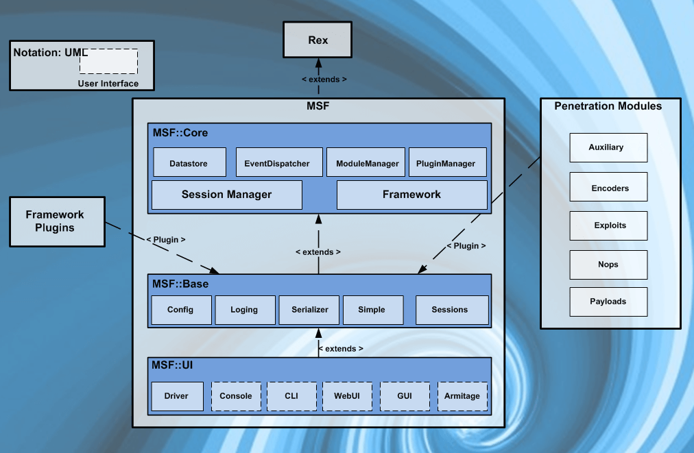
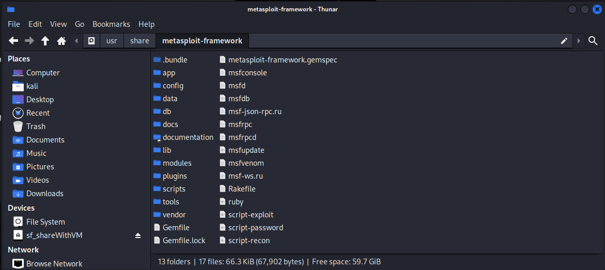
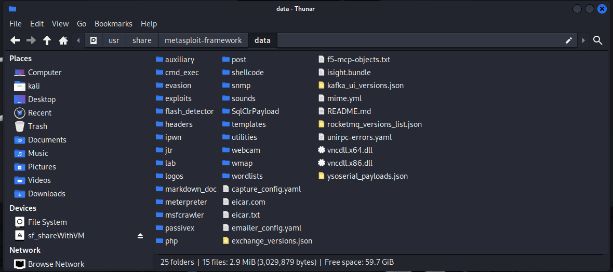
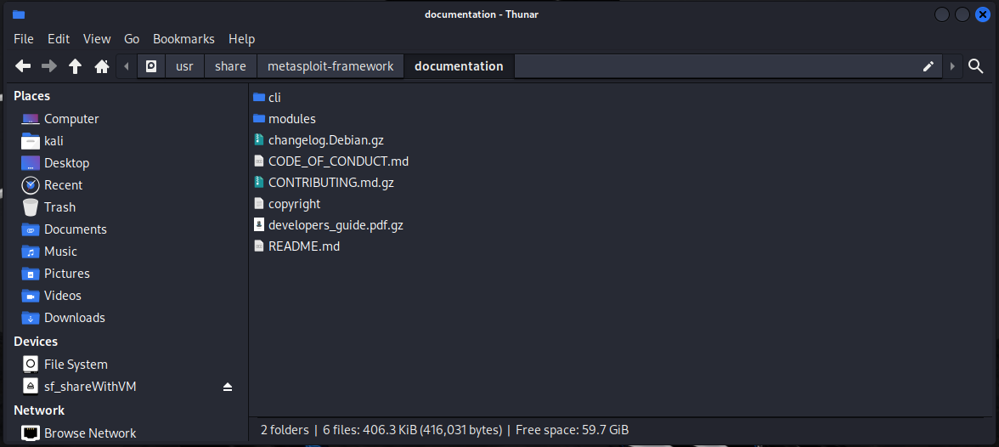
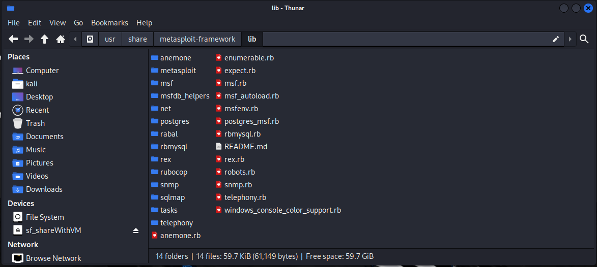
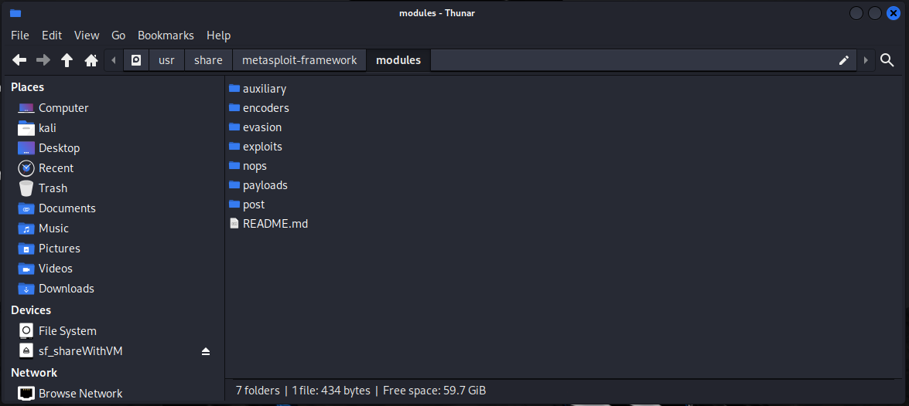
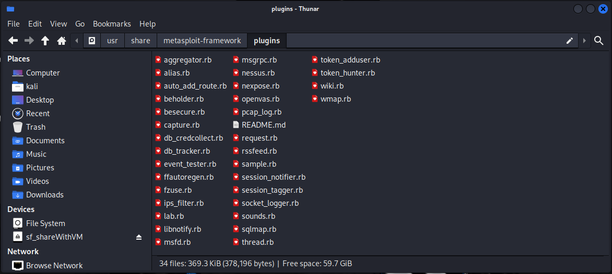
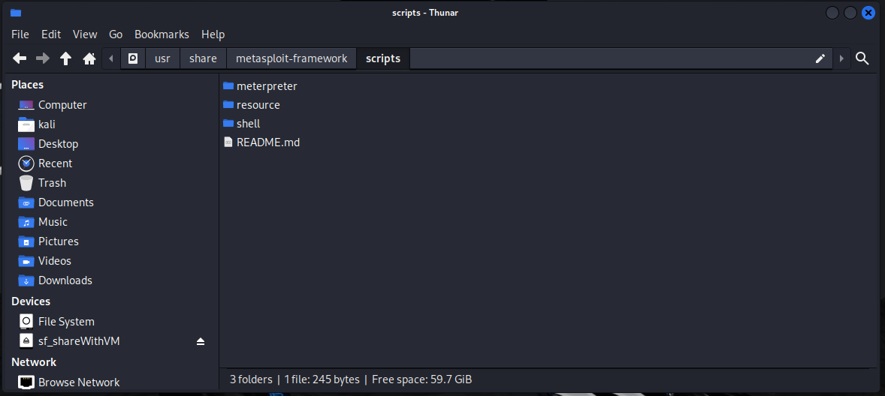
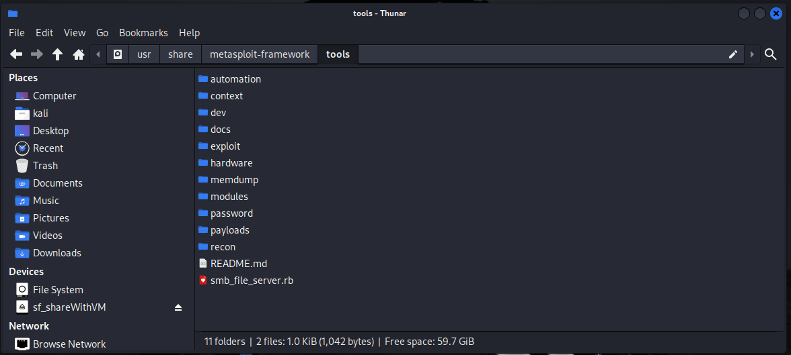

Metasploit is written in Ruby and has been in development for many years.

At first glance, the size of the project can be daunting but you will rarely need to delve deeply into its architecture.

In these next few sections, we will provide a high-level overview of how Metasploit is put together, which will be very valuable in getting comfortable with it.

# Filesystem And Libraries

One can more easily understand the Metasploit architecture by taking a look under its hood. 

In learning how to use Metasploit, take some time to make yourself familiar with its filesystem and libraries. 

In Kali Linux, Metasploit is provided in the metasploit-framework package and is installed in the /usr/share/metasploit-framework directory, the top-level of which is shown below.

## Metasploit Filesystem
The MSF filesystem is laid out in an intuitive manner and is organized by directory.

Some of the more important directories are briefly outlined below.

### data
The data directory contains editable files used by Metasploit to store binaries required for certain exploits, wordlists, images, and more.

### documentation
As its name suggests, the documentation directory contains the available documentation for the framework.

### lib
The lib directory contains the ‘meat’ of the framework code base.

### modules
The modules directory is where you will find the actual MSF modules for exploits, auxiliary and post modules, payloads, encoders, and nop generators.

### plugins
you will see later in this course, Metasploit includes many plugins, which you will find in this directory.

### scripts
The scripts directory contains Meterpreter and other scripts.

### tools
The tools directory has various useful command-line utilities.

## Metasploit Libraries
There are a number of MSF libraries that allow us to run our exploits without having to write additional code for rudimentary tasks, such as HTTP requests or encoding of payloads. 

Some of the most important libraries are outlined below.
### Rex
The basic library for most tasks
Handles sockets, protocols, text transformations, and others
SSL, SMB, HTTP, XOR, Base64, Unicode
### Msf::Core
Provides the ‘basic’ API
Defines the Metasploit Framework
### Msf::Base
Provides the ‘friendly’ API
Provides simplified APIs for use in the Framework

